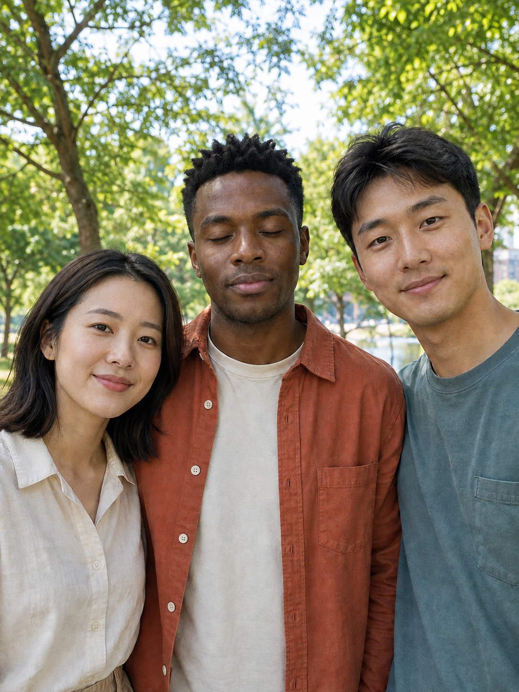
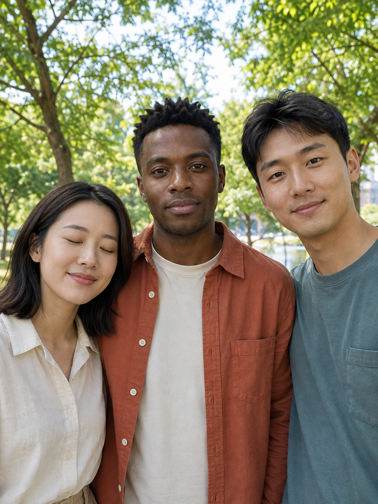
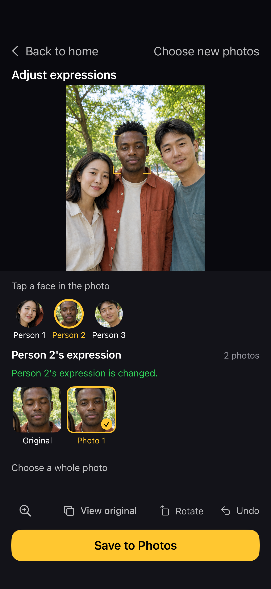

# How to fix a blink in an iPhone group photo using another shot

Someone blinked in a group photo you want to keep? If you have another photo of the same people with a usable expression, BetterTake lets you choose it for the group shot. Import 2–8 photos with similar camera angles and people in roughly the same positions. Editing runs on your iPhone, without an account.

**[Get BetterTake on the App Store](https://apps.apple.com/app/apple-store/id6810334268?pt=126854967&ct=bt_blink_guide_20260926&mt=8)** · iPhone · iOS 17+ · English, Simplified Chinese and Traditional Chinese

[简体中文](fix-a-blink.zh-Hans.md) · [Official support](README.md) · [Privacy](PRIVACY.md)

## Start with two usable photos

You need another photo in which the same person has the expression you want. BetterTake does not generate new eyes, smiles or faces from a single photo. Different photo sizes and capture times are supported in version 1.0.1; a steady, short sequence still gives you a better starting point.

**About this example:** the original photos below depict AI-generated fictional adults. The editing screenshot shows BetterTake's real photo-analysis and composition workflow on an iPhone. This illustrates the workflow, not a promise that every face or photo will work. Interface labels may vary by version.

### Photo A: the middle person is blinking

We want to keep this group photo but use the middle person's open-eyed expression from Photo B.

### Photo B: the middle person's eyes are open

The woman on the left is blinking in this photo. Choosing a whole photo would trade one blink for another; an available expression can help keep the preferred parts of both.

## 1. Import the original photos

Open BetterTake and choose 2–8 photos of the same people, or take a short burst in the app. Import your original photos, not a screenshot of this guide or an App Store advertisement. Photos stored in iCloud may need to download first.

## 2. Tap the person and choose an available expression

Tap the person you want to change, then select an available expression from another photo. In this example, the middle person's open-eyed expression comes from Photo B. Eyes and mouth change together from that source photo; they are not independently generated.

*The app's frame numbers depend on import order. Photo A and Photo B are labels used in this guide.*

## 3. Compare, zoom in, and save

Use the original comparison and zoom controls to inspect the eyes, mouth and surrounding area. Undo the change if it does not look right. Save to Photos when you are happy with the result; saving creates a new image rather than overwriting the original. Export is a JPEG at the original pixel dimensions, not a promise of lossless encoding.

## What if no expression is available?

A visible face is not enough: the source expression also needs to match and align reliably. A large change in angle, movement, covered faces or low light can limit the choices. Use a more similar photo if you have one. Otherwise keep the original expression or choose a whole source photo. Importing successfully does not guarantee a usable expression for every person.

If you only have one photo, BetterTake cannot invent the missing open-eyed expression. Single-person mode helps you choose a whole photo rather than combine expressions.

## Do my photos leave my iPhone?

Analysis and editing happen on your iPhone without uploading photos to a processing server. iCloud may download your originals through Apple's services, and sharing uses the destination you choose. No account is needed. [Read the privacy policy](PRIVACY.md).

**[Try BetterTake with your own photos](https://apps.apple.com/app/apple-store/id6810334268?pt=126854967&ct=bt_blink_guide_20260926&mt=8)**

Questions? [Email the developer](mailto:houzhenqing.colin@gmail.com). You can optionally say where you found BetterTake and, if it was ChatGPT, roughly what you asked. Do not send your full conversation or private photos; a description of the steps is enough to start.

Written by Zhenqing Hou, BetterTake's developer. Updated September 26, 2026. Describes photo-import and expression-editing features available in version 1.0.1; no unreleased sample button is required.
